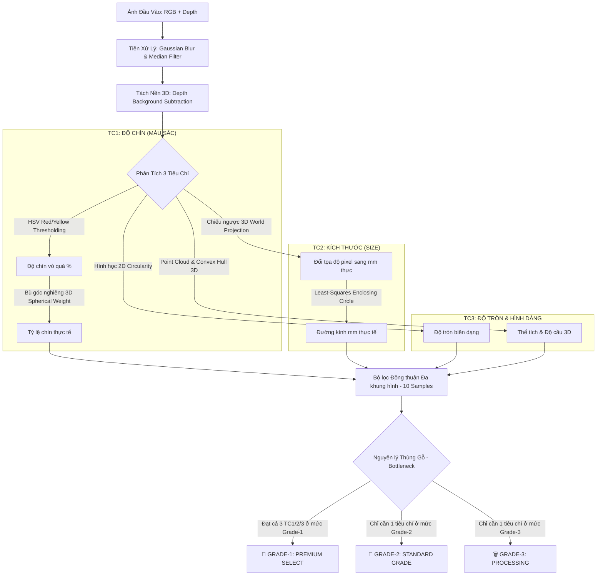

# 🍎 TÀI LIỆU TOÁN HỌC & GIẢI THUẬT: PHÂN LOẠI TÁO 3 TIÊU CHÍ (TC1, TC2, TC3)
*(Tài liệu học thuật chuyên sâu phục vụ báo cáo đồ án tốt nghiệp và thuyết trình)*

Hệ thống phân loại táo thông minh **OspreyX** tích hợp đồng bộ giữa xử lý ảnh màu **RGB (2D)** và cảm biến độ sâu **Depth (3D)** của camera **Orbbec Astra Pro**, phối hợp với điều khiển truyền thông **PLC S7-1200**. Dưới đây là phân tích chi tiết toán học và thuật toán của **3 Tiêu chí cốt lõi**.

---

## 📁 CẤU TRÚC PIPELINE RA QUYẾT ĐỊNH (DECISION TREE PIPELINE)

---

## 🍊 TIÊU CHÍ 1: ĐỘ CHÍN VỎ QUẢ (TC1 - RIPENESS ANALYSIS)

Thuật toán phân tích độ chín của táo dựa trên việc phân tích không gian màu **HSV (Hue-Saturation-Value)** để phân tách các vùng màu vỏ táo (Đỏ chín, Vàng chín vừa, Xanh chưa chín) kết hợp với **Bù góc nghiêng 3D (Spherical Correction Weight)**.

### 1. Phân Tách Không Gian Màu HSV
Không gian màu RGB rất nhạy cảm với sự thay đổi của ánh sáng. Do đó, hệ thống chuyển đổi ảnh sang HSV để tách biệt kênh màu sắc ($H$) độc lập với kênh độ sáng ($V$):
*   **Vùng Đỏ Chín 1:** $H \in [0, 10], S \in [50, 255], V \in [50, 255]$
*   **Vùng Đỏ Chín 2:** $H \in [170, 180], S \in [50, 255], V \in [50, 255]$
*   **Vùng Vàng Hơi Chín:** $H \in [11, 34], S \in [50, 255], V \in [50, 255]$
*   **Vùng Xanh Lá Chưa Chín:** $H \in [35, 85], S \in [50, 255], V \in [50, 255]$

Tỷ lệ phần trăm chín thô ($Red\_Ratio_{raw}$) được tính bằng tỷ lệ số pixel màu đỏ ($N_{red}$) trên tổng số pixel của quả táo ($N_{apple}$):

$$Red\_Ratio_{raw} = \frac{N_{red}}{N_{apple}} \times 100\%$$

### 2. Thuật Toán Bù Góc Nghiêng Hình Cầu 3D (Spherical Correction Weight)
Khi chụp ảnh 2D, các vùng thâm hoặc vùng màu đỏ nằm ở sát rìa quả táo sẽ bị bóp méo diện tích (nhỏ hơn thực tế) do bề mặt quả táo cong tròn (góc nghiêng của bề mặt so với trục camera lớn). Để khôi phục kích thước thực, ta nhân diện tích pixel ở khoảng cách $d$ từ tâm quả táo với hệ số bù:

$$Weight(d) = \frac{R_{apple}}{\sqrt{R_{apple}^2 - d^2}}$$

*   Tại tâm quả táo ($d=0$): Hệ số bù $Weight = 1.0$ (không đổi).
*   Tại rìa quả táo ($d \approx R$): Hệ số bù $Weight$ tăng dần lên tối đa là $3.0$ (giới hạn để tránh nhiễu vô hạn ở viền biên).

---

## 📏 TIÊU CHÍ 2: KÍCH THƯỚC QUẢ (TC2 - SIZE/DIAMETER CALCULATION)

Kích thước của quả táo không thể đo chính xác bằng pixel vì khoảng cách từ quả táo đến camera thay đổi (quả táo to hơn sẽ gần camera hơn). Do đó, hệ thống ứng dụng giải thuật **Chiếu ngược 3D thế giới thực (3D World Projection)**.

### 1. Phép Chiếu Ngược Tọa Độ 3D Thế Giới Thực
Từ ảnh Depth của camera Astra Pro, mỗi pixel tọa độ $(x, y)$ có một giá trị khoảng cách chiều sâu thực $Z$ (mm) từ camera đến bề mặt điểm đó.
Sử dụng tiêu cự hiệu chuẩn của camera ($f_x, f_y = 570.0$) và tâm quang học ($c_x, c_y$), tọa độ thực tế tính bằng Milimet (mm) được tính như sau:

$$X_{world} = \frac{(x - c_x) \times Z}{f_x}, \quad Y_{world} = \frac{(y - c_y) \times Z}{f_y}$$

### 2. Đo Đường Kính Thực Tế ($Diameter_{mm}$)
1.  Xác định tâm đường tròn bao $C(x_c, y_c)$ và bán kính pixel $R_{px}$ bằng giải thuật **Hough Circles** hoặc **Minimum Enclosing Circle** của đường viền quả táo.
2.  Lấy hai điểm biên đối diện trên trục nằm ngang qua tâm: $P_1(x_c - R_{px}, y_c)$ và $P_2(x_c + R_{px}, y_c)$.
3.  Chiếu ngược $P_1$ và $P_2$ sang tọa độ thực 3D: $P_{1\_world}(X_1, Y_1, Z_1)$ và $P_{2\_world}(X_2, Y_2, Z_2)$.
4.  Đường kính thực tính bằng khoảng cách Euclide thực tế giữa 2 điểm này:

$$Diameter_{mm} = \sqrt{(X_2 - X_1)^2 + (Y_2 - Y_1)^2 + (Z_2 - Z_1)^2}$$

---

## 🍏 TIÊU CHÍ 3: HÌNH DÁNG & ĐỘ TRÒN (TC3 - SHAPE & CIRCULARITY)

Tiêu chí Độ tròn phối hợp giữa thuật toán biên dạng **2D Circularity** và thuật toán hình cầu đám mây điểm **3D Sphericity** để loại bỏ hoàn toàn các quả táo méo, dẹp, dị dạng.

### 1. Công Thức Tính Độ Tròn 2D (Circularity)
Độ tròn được tính dựa trên tỷ lệ vàng giữa Diện tích ($Area$) và Chu vi ($Perimeter$) của quả táo:

$$Circularity = \frac{4\pi \times Area}{Perimeter^2}$$

*   Một hình tròn hoàn hảo có $Circularity = 1.0$.
*   Quả táo tròn đều đạt hạng xuất khẩu (Grade-1) khi có $Circularity \ge 0.88$.
*   Quả táo hơi méo (Grade-2) when nằm trong khoảng $0.78 \le Circularity < 0.88$.
*   Quả táo dị dạng, hỏng hình dáng (Grade-3) khi có $Circularity < 0.78$.

### 2. Độ Cầu 3D (3D Sphericity)
Từ đám mây điểm 3D (Point Cloud) bề mặt quả táo, hệ thống thực hiện giải thuật khớp hình cầu tối thiểu **Least-Squares Sphere Fitting**:

$$\min_{X_c, Y_c, Z_c, R} \sum_{i=1}^{N} \left( \sqrt{(X_i - X_c)^2 + (Y_i - Y_c)^2 + (Z_i - Z_c)^2} - R \right)^2$$

Độ cầu 3D ($Sphericity$) được định nghĩa bằng độ lệch chuẩn của các bán kính đo từ tâm khớp ra các điểm thực tế chia cho bán kính trung bình:

$$Sphericity = 1.0 - \frac{\sigma(R_i)}{\bar{R}}$$

---

## 🎯 BỘ LỌC ĐỒNG THUẬN ĐA KHUNG HÌNH & NGUYÊN LÝ THÙNG GỖ (DECISION FUSION)

Để đưa ra quyết định phân hạng chính xác nhất, hệ thống ứng dụng hai nguyên lý bảo hiểm công nghiệp:

### 1. Đồng Thuận Đa Khung Hình (Multi-frame Consensus)
Khi quả táo di chuyển qua vùng quét trên băng tải, camera chụp liên tục **10 mẫu ảnh (10 frames)**. Quyết định cuối cùng áp dụng bộ lọc đồng thuận **Majority Voting** kết hợp với **Bảo hiểm rủi ro tối đa**:
*   Nếu quả táo có trên **3/10 khung hình** bị phát hiện lỗi méo nặng hoặc thâm thối nặng (Grade-3) $\rightarrow$ Quyết định cuối cùng lập tức bị chốt là **Grade-3** để loại bỏ triệt để hàng lỗi.

### 2. Nguyên Lý Thùng Gỗ (Bottleneck Principle)
Hạng chất lượng tổng hợp của quả táo bị quyết định bởi tiêu chí có kết quả thấp nhất trong 3 tiêu chí:

$$Overall\_Grade = \max(TC1\_Grade, TC2\_Grade, TC3\_Grade)$$
*(Với quy ước thứ tự xếp hạng: Grade-3 > Grade-2 > Grade-1)*

*   **🍏 GRADE-1 (Premium):** Đạt Grade-1 ở cả 3 tiêu chí.
*   **🔹 GRADE-2 (Standard):** Có ít nhất 1 tiêu chí đạt Grade-2, và không có tiêu chí nào bị Grade-3.
*   **🗑️ GRADE-3 (Reject/Processing):** Chỉ cần 1 trong 3 tiêu chí rơi xuống Grade-3.

---

## 📍 VỊ TRÍ HÀM XỬ LÝ TRONG MÃ NGUỒN (CODE MAP)
*   **Thuật toán RGB-D & Tách nền 3D:** Xem hàm `_segment_apple` tại [analyzer.py](file:///d:/DOAN_PLC_Phanloaitao/giaodien/Processing/analyzer.py#L457-L578).
*   **Thuật toán TC1 (Độ chín):** Xem hàm `_classify_ripeness` tại [analyzer.py](file:///d:/DOAN_PLC_Phanloaitao/giaodien/Processing/analyzer.py#L582-L596).
*   **Thuật toán TC2 (Kích thước):** Xem hàm `_classify_size` tại [analyzer.py](file:///d:/DOAN_PLC_Phanloaitao/giaodien/Processing/analyzer.py#L597-L610).
*   **Thuật toán TC3 (Độ tròn/Hình dáng):** Xem hàm `_classify_shape` tại [analyzer.py](file:///d:/DOAN_PLC_Phanloaitao/giaodien/Processing/analyzer.py#L612-L620).
*   **Thuật toán Phân hạng tổng hợp:** Xem hàm `_overall_grade` tại [analyzer.py](file:///d:/DOAN_PLC_Phanloaitao/giaodien/Processing/analyzer.py#L621-L635).
*   **Thuật toán Đám mây điểm 3D & Thể tích Convex Hull:** Xem class `Apple3DAnalyzer` trong file [apple_3d.py](file:///d:/DOAN_PLC_Phanloaitao/giaodien/modules/apple_3d.py).
