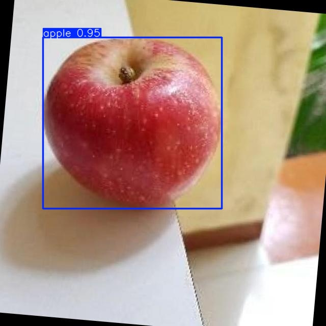

# 📒 NHẬT KÝ ĐỒ ÁN — Phân Loại Táo Bằng PLC + Vision

> **Mục đích**: Ghi lại tất cả vấn đề, lỗi, thay đổi, và kinh nghiệm tích lũy trong quá trình làm đồ án.
> **Cách dùng**: File này được cập nhật liên tục theo thứ tự thời gian (mới nhất ở trên).

---

## 📅 2026-06-14 (Chủ Nhật)

### 12:45 — Huấn luyện thành công mô hình YOLOv8n nhận dạng táo

#### 🔍 Thông tin huấn luyện (Training Specs)
- **Dataset:** 1117 ảnh được phân tách theo tỉ lệ 80/20 (893 ảnh train, 224 ảnh validation).
- **Mô hình gốc:** YOLOv8n (Nano) - 130 layers, 3,011,043 tham số.
- **Môi trường:** Google Colab với GPU Tesla T4 (15GB VRAM).
- **Cấu hình tham số train:**
  - `epochs=150`, `batch=16`, `imgsz=640`
  - Bật tính năng Tự động dừng sớm (`patience=15`) - tự ngắt nếu 15 epochs liên tiếp không tiến bộ.
  - Sử dụng Cosine Learning Rate Schedule (`cos_lr=True`).

#### 🔬 Tiến trình & Kết quả
- **Hiện tượng dừng sớm (Early Stopping):** Quá trình huấn luyện tự động dừng ở epoch thứ 90 vì mô hình đạt kết quả tối ưu nhất ở epoch thứ 75 (không cải thiện thêm trong 15 epoch sau đó).
- **Thời gian huấn luyện:** 0.515 giờ (~31 phút).
- **Độ chính xác đạt được (Validation Metrics tại epoch 75):**
  - **Precision (Độ chính xác dự đoán quả táo):** `0.999` (99.9%)
  - **Recall (Tỉ lệ tìm sót quả táo):** `0.996` (99.6%)
  - **mAP50:** `0.995` (99.5%) - Độ khớp khung hình khi IoU >= 0.5
  - **mAP50-95:** `0.939` (93.9%) - Độ khớp khung hình trung bình từ IoU 0.5 đến 0.95 (chỉ số cực kỳ cao và ổn định)
  
  

#### ✅ Giải pháp & Triển khai
- Xuất tệp tin trọng số tốt nhất `best.pt` (~6.2 MB) và tải về máy.
- Chép tệp tin `best.pt` vào thư mục `giaodien/best.pt` của dự án để tích hợp trực tiếp vào ứng dụng chạy thời gian thực.
- Cập nhật tài liệu dự án `README.md` về luồng xử lý Hybrid Segmentation.

---

## 📅 2026-06-13 (Thứ Bảy)

### 00:05 — Khắc phục lỗi "Kẹt Session" không lưu lịch sử / không gửi PLC

#### 🔍 Vấn đề phát hiện
Từ 18:51 đến 23:03, log liên tục báo nhận diện `Grade-2` (ở mode preview 1 frame) nhưng không hề lưu lịch sử và xy lanh không đẩy táo.

#### 🔬 Nguyên nhân gốc
1. **Trigger cạnh lên**: `_poll_plc` chỉ kích hoạt chụp khi cảm biến chuyển từ OFF sang ON. Do táo trước đó không được đẩy đi (có thể do lỗi), cảm biến kẹt ở ON, hệ thống mãi mãi chờ cạnh lên mới.
2. **Timeout lỏng lẻo**: Lệnh huỷ timeout ở 6 giây chỉ kiểm tra nếu thu thập được `0 frame`. Nếu đã có 2-3 frame mà bị kẹt thì phiên chụp treo vĩnh viễn.
3. **Race Condition PLC**: Hàm `reset_grades` ghi toàn bộ byte trạng thái DB10.DBB0. Nếu cảm biến đang chuyển trạng thái, ghi nguyên byte cũ có thể đè mất trạng thái thực của phần cứng.

#### ✅ Giải pháp đã áp dụng
1. **Re-trigger**: Trong `gui_app.py`, thêm `elif sensor_on and prev and not self._capture_session_active:` → tự động ép trigger lại sau khi phiên cũ đã finalize.
2. **Strict Timeout**: Trong vòng lặp chính, nếu quá 6s:
   - Nếu >= 6 frame: **Ép chốt kết quả**.
   - Nếu < 6 frame: **Hủy báo lỗi**.
3. **Sửa PLC Snap7**: Trong `plc.py`, đổi `reset_grades` sang việc gọi `write_db_bit` 3 lần tách biệt cho Grade 1, 2, 3 thay vì đọc/sửa/ghi toàn khối 8-bit.

#### 📁 Files đã sửa
- `giaodien/modules/gui_app.py` — vòng lặp main (dòng 3460) và `_poll_plc` (dòng 3944).
- `giaodien/modules/plc.py` — hàm `reset_grades` (dòng 318).

#### 💡 Kinh nghiệm rút ra
1. **Khi lập trình PLC với Snap7**, hạn chế tối đa việc đọc/ghi nguyên `byte/word` nếu trên đó chứa tín hiệu từ cảm biến vật lý. LUÔN ghi từng `bit` cụ thể.
2. **Sự kiện phần cứng có thể bị lỗi (kẹt cảm biến)**. Phần mềm phải luôn có phương án timeout cưỡng bức hoặc re-trigger để tự giải cứu hệ thống, không được "tin tưởng tuyệt đối" vào chu kỳ tuần tự.

---

## 📅 2026-06-12 (Thứ Sáu)

### 23:10 — Khắc phục hiện tượng Frame 3 chất lượng thấp khi chụp 10 tấm

#### 🔍 Vấn đề phát hiện
Khi chụp 10 frame trong 1 giây, **Frame 3** luôn cho kết quả xấu:
- YOLO confidence chỉ **0.36** (thấp nhất trong 10 frame)
- Circularity (độ tròn) chỉ **0.361** — contour bị méo
- Grade bị phân loại sai (Grade-2 thay vì Grade-1)

#### 🔬 Nguyên nhân gốc
Táo đang xoay trên **2 con lăn 24VDC** ở tốc độ **~60 vòng/phút** (1 vòng/giây).
Với 10 frame/giây, mỗi frame cách nhau **36°**. Frame 3 rơi đúng **"góc chết"** khi:
1. **Vùng cuống/đáy táo** hướng về camera → hình dạng khác biệt
2. **Con lăn che khuất** viền dưới táo → segmentation sai
3. **Phản xạ ánh sáng** thay đổi theo góc xoay → YOLO nhận diện kém

> **Bài học**: Tốc độ con lăn 60 RPM + 10 fps → luôn có 1-2 frame rơi vào góc bất lợi. Đây là hiện tượng **không thể tránh hoàn toàn bằng phần cứng**, phải xử lý bằng **phần mềm (lọc frame)**.

#### ✅ Giải pháp đã áp dụng — Phòng thủ 3 lớp

| Lớp | Thay đổi | File | Trước → Sau |
|-----|----------|------|-------------|
| 1 | Tăng `YOLO_CONF_THRESH` | `Processing/analyzer.py` | 0.35 → **0.45** |
| 2 | Thêm bộ lọc `circularity < 0.50` | `Processing/analyzer_modules/session_decision.py` | Không có → **Phạt weight nặng** |
| 3 | Tăng `decision_min_quality_score` | `giaodien/modules/gui_app.py` + config | 0.45 → **0.50** |

**Chi tiết kỹ thuật:**
- **Lớp 1**: Frame 3 (conf=0.36) < ngưỡng mới (0.45) → bị loại ngay, không xử lý
- **Lớp 2**: Nếu frame nào lọt qua YOLO nhưng circularity < 0.50 → `quality *= circularity/0.50` (giảm 28-90% trọng số)
- **Lớp 3**: Frame có quality_score < 0.50 → bị loại khỏi weighted voting, không ảnh hưởng kết quả

```
Frame vào → [YOLO_CONF ≥ 0.45] → [Circularity ≥ 0.50] → [quality ≥ 0.50] → Voting
            ↓ loại                 ↓ phạt weight           ↓ loại
```

#### 📁 Files đã sửa
- `Processing/analyzer.py` — dòng 125, 152
- `Processing/analyzer_modules/session_decision.py` — hàm `compute_frame_quality_weight`
- `giaodien/modules/gui_app.py` — dòng 386
- `giaodien/config/runtime_config.py` — dòng 62
- `giaodien/config/system_config.json` — dòng 97

#### 💡 Kinh nghiệm rút ra
1. **Không nên đặt YOLO_CONF_THRESH quá thấp** (0.35 là quá thoáng). Ngưỡng 0.45 phù hợp hơn cho môi trường thực tế có con lăn xoay
2. **Circularity là chỉ số quan trọng** để phát hiện frame segment sai — nên dùng nó làm tiêu chí lọc
3. **Hệ thống voting đa frame** (10 tấm) rất mạnh, nhưng cần **lọc frame xấu trước** để tránh 1-2 frame nhiễu kéo lệch kết quả
4. **Tốc độ con lăn vs FPS camera**: 60 RPM ÷ 10 fps = 36°/frame. Nếu tăng FPS lên 15-20 sẽ giảm góc chết nhưng tốn tài nguyên xử lý

---

<!-- 
═══════════════════════════════════════════════════════
  TEMPLATE CHO CÁC MỤC MỚI (copy và điền khi có vấn đề mới)
═══════════════════════════════════════════════════════

## 📅 YYYY-MM-DD (Thứ ?)

### HH:MM — Tiêu đề ngắn gọn

#### 🔍 Vấn đề phát hiện
Mô tả vấn đề...

#### 🔬 Nguyên nhân gốc
Phân tích nguyên nhân...

#### ✅ Giải pháp đã áp dụng
Chi tiết giải pháp...

#### 📁 Files đã sửa
- `path/to/file` — mô tả thay đổi

#### 💡 Kinh nghiệm rút ra
1. Bài học 1
2. Bài học 2

---
-->
